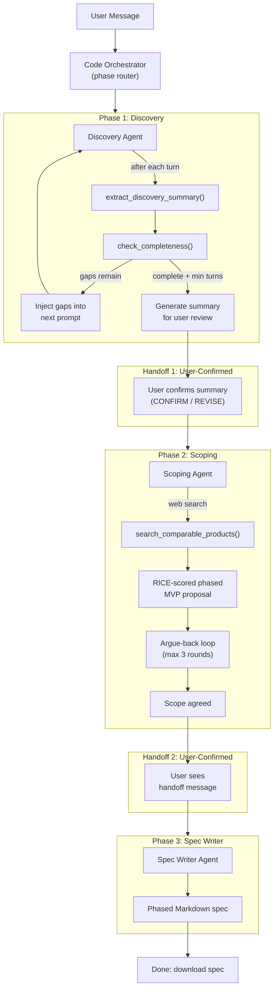
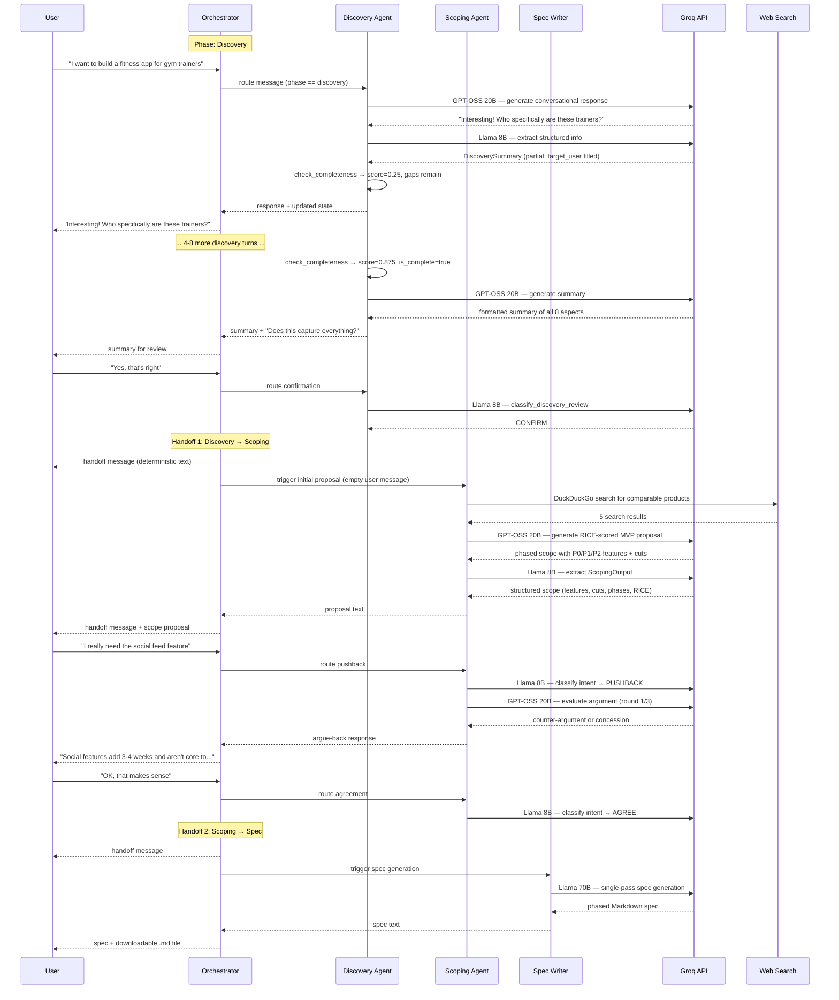
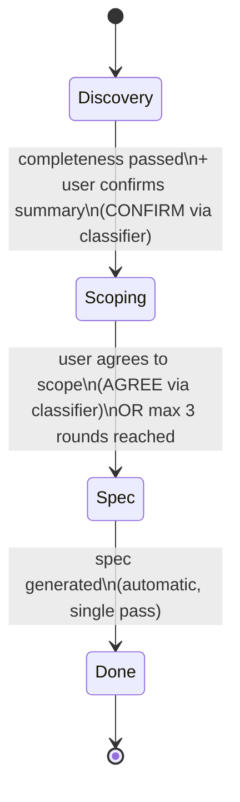
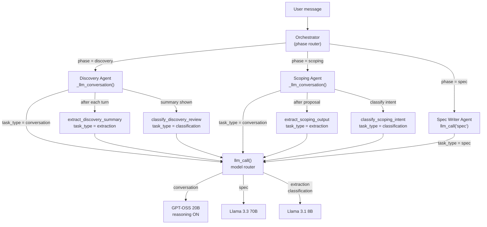
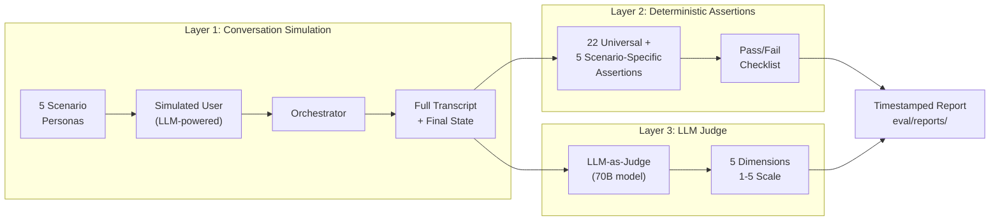

# High Level Design: AI PM Agent

---

## 1. Executive Summary

The AI PM Agent is a conversational system that turns rough product ideas into structured, phased product specs through a 3-phase pipeline: **Discovery**, **Scoping**, and **Spec Writer**. It replaces the manual back-and-forth of traditional PM discovery with one conversation that interviews the founder, proposes a RICE-scored MVP scope backed by competitive research, negotiates cuts, and produces a downloadable Markdown spec ready for developers or AI code-generation tools.

**Who it's for:** Founders, indie hackers, and early-stage teams who have a product idea but lack PM expertise to structure it into a buildable plan.

**One-sentence value prop:** One conversation replaces weeks of PM process -- from vague idea to phased, prioritized product spec.

**Created by:** [Vinayak Rastogi](https://www.linkedin.com/in/vinayak1998/)

---

## 2. System Architecture Overview

The system follows a strictly sequential 3-phase pipeline. A **code-based orchestrator** (no LLM) routes user messages to the active agent and enforces deterministic, user-confirmed transitions between phases.



### Key Architectural Principles

- **Sequential, not parallel.** Each phase completes before the next begins. No backtracking.
- **Deterministic transitions.** The orchestrator uses if/else routing by `state.phase`, not LLM-based decisions.
- **User-confirmed handoffs.** Every phase transition requires explicit user agreement. No silent jumps.
- **Separation of concerns.** Each agent owns its phase. The orchestrator owns transitions. Tools own structured operations.

---

## 3. Core Data Flow

The following sequence diagram traces a complete user journey from initial idea to downloadable spec.



### What Happens at Each Phase

| Phase | Input | Process | Output |
|-------|-------|---------|--------|
| **Discovery** | User's raw idea | PM-style interview covering 8 aspects (target user, core problem, alternatives, why now, feature wishlist, success metric, revenue model, constraints). One question at a time. Extract and check completeness after every turn. | `DiscoverySummary` (structured, user-confirmed) |
| **Scoping** | `DiscoverySummary` | Web search for comparables. RICE-scored, phased MVP proposal. Cut aggressively. Argue-back with the user for up to 3 rounds. | `ScopingOutput` (MVP features, cut features, RICE scores, implementation phases, comparable products) |
| **Spec Writer** | `DiscoverySummary` + `ScopingOutput` | Single-pass Markdown generation following a phased template. No conversation. | `spec_markdown` (downloadable product spec) |

---

## 4. Agent Architecture

### 4.1 Agent Roles and Boundaries

| Agent | Responsibility | Tools Used | Output |
|-------|----------------|------------|--------|
| **Discovery Agent** | Conduct a PM-style discovery interview. Cover 8 aspects. Probe vague answers. One question at a time. Validate output (no tables/PRDs, no multi-question turns). | `extract_discovery_summary`, `check_completeness`, `classify_discovery_review` | Fills `DiscoverySummary`; shows summary for user confirmation when complete. |
| **Scoping Agent** | Take discovery output. Search comparables. Propose RICE-scored, phased MVP scope. Cut aggressively. Handle pushback (max 3 negotiation rounds). | `search_comparable_products`, `extract_scoping_output`, `classify_scoping_intent` | Fills `ScopingOutput` (MVP features, cut features, implementation phases, RICE scores). |
| **Spec Writer Agent** | Single-pass generation. Take discovery + scoping data. Produce phased Markdown spec. Non-conversational. | `SPEC_TEMPLATE`, `llm_call("spec")` | `spec_markdown` (phased product spec document). |
| **Orchestrator** (code, not an agent) | Route messages by `state.phase`. Enforce handoffs. Prevent skipping. Show progress indicators. | None (pure Python routing) | Phase transitions, handoff messages. |

### 4.2 Why 3 Specialized Agents, Not 1 Mega-Prompt

A single agent with one massive prompt would need to handle discovery interviewing, competitive research, RICE scoring, argue-back negotiation, and spec writing -- all in one context window. This creates several problems:

1. **Prompt dilution.** The more instructions you pack into one prompt, the less reliably the model follows each one. A discovery-focused prompt produces better interviews than a mega-prompt.
2. **Model mismatch.** Discovery needs a reasoning model (coherent multi-turn dialogue). Spec generation needs a large model (long-form structured writing). Extraction needs a fast model (cheap JSON parsing). One-size-fits-all wastes cost or sacrifices quality.
3. **Testability.** With 3 agents, each phase can be evaluated independently. The eval framework tests discovery depth, scoping quality, and spec accuracy as separate dimensions.
4. **State clarity.** Each agent owns a specific portion of the state (`DiscoverySummary`, `ScopingOutput`, `spec_markdown`). No ambiguity about which agent writes which data.

**Tradeoff accepted:** We lose some cross-phase nuance (e.g., the scoping agent doesn't "remember" the conversational tone of discovery). We accept this because the structured data handoff (`DiscoverySummary`) carries all the substance.

### 4.3 Phase Transitions and Handoff Protocol

All transitions are **deterministic** and **user-confirmed**:



**Handoff 1 (Discovery → Scoping):**
1. Discovery agent detects completeness (score >= 0.75, mandatory fields filled, min 4 user turns).
2. Agent generates a summary and asks user to confirm.
3. User responds. Intent classified as CONFIRM or REVISE.
4. On CONFIRM: orchestrator sets phase to scoping, shows a deterministic handoff message, then immediately triggers the scoping agent's initial proposal (web search + RICE-scored scope). User sees: handoff text + scope proposal in one response.

**Handoff 2 (Scoping → Spec):**
1. User agrees to scope (intent classified as AGREE), or 3 negotiation rounds are exhausted (graceful concession).
2. Orchestrator sets phase to spec, shows handoff message, triggers spec writer.
3. User sees: handoff text + full spec + download link.

**Skip prevention:** If the user tries to jump ahead (e.g., "just write the spec"), the orchestrator detects skip-intent phrases and responds with a gentle redirect instead of complying.

---

## 5. Mixture of Experts (MoE) Model Routing

The system uses a **task-based Mixture of Experts** architecture: one model per task type, selected statically in code. There is no dynamic router or content-based routing -- the call site specifies the task type, and `llm_call()` maps it to the right model.

### 5.1 Model Strategy

| Task Type | Model | Model ID | Rationale |
|-----------|-------|----------|-----------|
| **conversation** | GPT-OSS 20B (reasoning) | `groq/openai/gpt-oss-20b` | Cheapest thinking model on Groq. Emits explicit reasoning for coherent multi-turn PM dialogue. Used in Discovery and Scoping. |
| **spec** | Llama 3.3 70B | `groq/llama-3.3-70b-versatile` | Best long-form structured writing. Used only for single-pass spec generation. Quality over speed. |
| **extraction** | Llama 3.1 8B | `groq/llama-3.1-8b-instant` | JSON schema-filling is classification-grade work. Fast and cheap. |
| **classification** | Llama 3.1 8B | `groq/llama-3.1-8b-instant` | Small label set (CONFIRM/REVISE, AGREE/PUSHBACK/QUESTION). 8B is sufficient. |

### 5.2 Cost and Speed

| Model | Input (per 1M tokens) | Output (per 1M tokens) | Speed (tokens/s) | Used For |
|-------|----------------------|------------------------|-------------------|----------|
| GPT-OSS 20B | $0.075 | $0.30 | ~1000 | conversation |
| Llama 3.3 70B | $0.59 | $0.79 | ~280 | spec |
| Llama 3.1 8B | $0.05 | $0.08 | ~560 | extraction, classification |

Most turns use one 8B call (extraction or classification) and one 20B call (conversation). Only the final spec uses the 70B model. This keeps per-conversation cost low while maintaining quality where it matters.

### 5.3 Routing Architecture



### 5.4 Why Reasoning is Enabled Only for Conversation

The conversation model (GPT-OSS 20B) has a `reasoning_effort` parameter (low/medium/high) that controls how much "thinking" the model does before responding. This is enabled only for the `conversation` task type because:

- **Discovery and Scoping require nuance.** Probing vague answers, constructing counter-arguments, and maintaining conversational coherence across many turns benefits from explicit chain-of-thought reasoning.
- **Extraction and classification don't.** Filling a JSON schema or choosing between 2-3 labels is straightforward. Extra reasoning tokens would add cost and latency without improving accuracy.
- **Spec generation doesn't use it** because the 70B model doesn't support the same reasoning parameter, and one-shot generation from structured data doesn't require multi-step reasoning.

Default: `REASONING_EFFORT = "medium"`, `INCLUDE_REASONING = False` (reasoning happens internally but isn't returned to the caller).

---

## 6. Technology Stack and Choices

### 6.1 Core Stack

| Component | Technology | Why |
|-----------|-----------|-----|
| **LLM Models** | Open-source only (Llama, GPT-OSS) | Zero vendor lock-in. Portable across providers. Cost-effective. |
| **Inference Provider** | Groq | Fastest inference. Free tier for development. LPU hardware gives sub-second latency. |
| **LLM Abstraction** | LiteLLM | Single `acompletion()` interface across providers. Swap Groq for Together/OpenRouter by changing one config line. |
| **Schemas** | Pydantic v2 | Type safety, validation, serialization. Every state mutation is validated. |
| **UI** | Chainlit | Purpose-built for chat agents. Provides streaming, sessions, file downloads, message authorship with minimal code. |
| **Web Search** | DuckDuckGo (`duckduckgo-search`) | Free, no API key. Sufficient for finding comparable products. Aligns with zero-cost principle. |
| **Framework** | None (plain Python) | No LangChain, no LangGraph. The orchestrator is a Python if/else. Fully debuggable, testable, and transparent. |

### 6.2 Key Technology Decisions

**Why open-source models only?**
The project goal is zero vendor lock-in and cost-effective inference. Proprietary models (GPT-4, Claude) would offer higher quality in some areas but create provider dependency and higher costs. The quality gap is narrowed by using task-specific models (the MoE approach) rather than one model for everything.

**Why Groq as primary provider?**
Groq's LPU hardware delivers the fastest inference speeds available (280-1000 tokens/sec depending on model). The free tier is generous enough for development and demos. Backup: Together AI, OpenRouter.

**Why Chainlit over Streamlit/Gradio?**
Chainlit is purpose-built for conversational agents. It provides session management, streaming, file downloads, message authorship labels, and step indicators out of the box. A chat agent in Streamlit or Gradio would require significantly more UI code for the same experience.

**Why no LangChain/LangGraph?**
The orchestration logic is simple enough that a framework adds complexity without value. The orchestrator is ~80 lines of if/else Python. Every state transition is explicit and debuggable. Adding a framework would introduce abstraction layers that make debugging harder and create a learning curve for contributors.

**Why in-memory state only?**
For an MVP/portfolio project, in-memory state (Chainlit session) is sufficient. There's no multi-user persistence requirement. Adding a database would be straightforward later (serialize `ConversationState` to Postgres/Redis) but isn't needed now.

---

## 7. Evaluation Framework

The eval system uses a **3-layer architecture** to test the agent from multiple angles, with increasing sophistication at each layer.

### 7.1 Three Evaluation Layers



| Layer | What It Tests | Cost | Determinism |
|-------|--------------|------|-------------|
| **Layer 1: Conversation** | Can the agent complete a full pipeline with a realistic simulated founder? | LLM calls for both agent and simulated user | N/A (generates data) |
| **Layer 2: Assertions** | Did the agent produce correct structured outputs? Were phases visited? Were features scored? | Zero (pure Python checks) | Fully deterministic |
| **Layer 3: LLM Judge** | Was the conversation natural? Were the right questions asked? Was the spec accurate? | One 70B LLM call per scenario | Non-deterministic (LLM scoring) |

### 7.2 Five Scenario Personas

Each scenario simulates a different founder archetype to test different agent capabilities:

| Scenario | Persona | Message Policy | What It Tests |
|----------|---------|---------------|---------------|
| **vague_founder** | Gives minimal, vague answers until probed | `minimal` | Discovery depth: does the agent probe deeper when answers are thin? |
| **over_scoper** | Provides a 15+ feature wishlist, accepts cuts | `expansive` | Scoping quality: does the agent cut aggressively and justify cuts? |
| **clear_thinker** | Has a well-defined idea, answers clearly | `expansive` | Efficiency: does the agent finish quickly without unnecessary turns? |
| **arguer** | Pushes back hard on feature cuts | `pushback` | Argue-back quality: does the agent hold firm or concede with reasoning? |
| **pivoter** | Shifts the idea mid-conversation | `pivot` | Adaptability: does the agent handle a mid-stream pivot gracefully? |

### 7.3 Running Evals

```bash
python eval/runner.py            # Layer 1 + 2 only (assertions)
python eval/runner.py --judge    # Layer 1 + 2 + 3 (with LLM judge)
```

Output: timestamped report at `eval/reports/eval_YYYYMMDD_HHMMSS.md` with per-scenario assertion results, and (if `--judge`) rubric scores across 5 dimensions.

### 7.4 Latest Results (Mar 9, 2026)

| Scenario | Assertions Passed | Turns | Reached Done | Spec Length |
|----------|------------------|-------|--------------|-------------|
| vague_founder | 23/23 | 11 | Yes | 2132 chars |
| over_scoper | 21/23 | 6 | Yes | 2415 chars |
| clear_thinker | 23/23 | 6 | Yes | 3554 chars |
| arguer | 22/23 | 10 | Yes | 2231 chars |
| pivoter | 22/23 | 8 | Yes | 3018 chars |
| **Total** | **111/115** | | | |

---

## 8. Design Decisions and Tradeoffs

This section consolidates all major architectural decisions, their rationale, alternatives considered, and tradeoffs accepted. See [DECISION_LOG.md](DECISION_LOG.md) for the full chronological log.

### 8.1 Multi-Agent vs Single Agent

| | Decision | Alternative |
|---|----------|-------------|
| **Chose** | 3 specialized agents + code orchestrator | Single mega-prompt agent |
| **Why** | Separation of concerns, per-phase testability, model-per-task optimization | Simpler code, cross-phase context sharing |
| **Tradeoff** | Added routing/orchestration code; lost some conversational continuity across phases | |

### 8.2 Code Orchestrator vs LLM Orchestrator

| | Decision | Alternative |
|---|----------|-------------|
| **Chose** | Deterministic code-based orchestrator (if/else routing) | LLM-based orchestrator that decides when to transition |
| **Why** | Predictable, debuggable, no hallucinated transitions | More flexible routing, handles edge cases gracefully |
| **Tradeoff** | Lost flexibility (e.g., "go back to discovery" is not supported); gained determinism and debuggability | |

### 8.3 Completeness Checkpoint vs Per-Aspect State Machine

The Discovery agent went through a significant architectural evolution:

1. **V1: Per-aspect state machine** -- Each of the 8 discovery aspects had its own confirm/revise cycle. An intent classifier ran after every turn to check if the user confirmed the current aspect before moving to the next.
2. **Problem:** The state machine was fragile. The LLM would generate tables/PRDs instead of asking questions. Premature formalization triggered when extraction filled a field from the user's first message. The intent classifier created dead loops.
3. **V2: Simplified checkpoint** -- Replaced the per-aspect FSM with free-form conversation + extraction after every turn + a single completeness checkpoint. When completeness passes (score >= 0.75, mandatory fields filled, min 4 turns), the agent shows a summary for user confirmation.

| | Decision | Alternative |
|---|----------|-------------|
| **Chose** | Free-form discovery with completeness checkpoint | Per-aspect formalize-then-confirm state machine |
| **Why** | Eliminates dead loops, premature formalization, and rigid flow. More natural conversation. | Per-aspect gives finer-grained control and ensures nothing is missed |
| **Tradeoff** | Lost per-aspect confirmation granularity; gained robustness and natural flow | |

### 8.4 RICE Scoring for Feature Prioritization

| | Decision | Alternative |
|---|----------|-------------|
| **Chose** | RICE framework (Reach, Impact, Confidence, Effort) | MoSCoW, WSJF, subjective P0/P1/P2 |
| **Why** | Quantitative, defensible, widely understood. Forces the agent to justify every priority with numbers. | Simpler frameworks require less data but produce less rigorous output |
| **Tradeoff** | RICE scores can feel formulaic; extraction occasionally produces null scores | |

### 8.5 Phased Implementation Planning

| | Decision | Alternative |
|---|----------|-------------|
| **Chose** | 3-phase implementation plan (Core MVP, Essential Additions, Growth & Polish) | Flat feature list with priorities |
| **Why** | Each phase is independently buildable and testable. Designed for AI code-gen tools (e.g., Cursor, Replit Agent) that build one phase at a time. | Simpler output, less opinionated |
| **Tradeoff** | More complex extraction and spec template; occasional phase boundary disputes | |

### 8.6 Simulated User vs Fixed Message Lists for Eval

| | Decision | Alternative |
|---|----------|-------------|
| **Chose** | LLM-powered simulated user with persona and message policy | Fixed list of hardcoded user messages |
| **Why** | Fixed messages can't adapt to agent responses. The agent asks different questions each run, so responses need to be contextual. Simulated user produces realistic multi-turn conversations that reach all 3 phases. | Fixed messages are deterministic and cheaper |
| **Tradeoff** | Non-deterministic eval (runs vary); LLM cost for simulation; rate limit management | |

### 8.7 Same Model for Generation and Judging

| | Decision | Alternative |
|---|----------|-------------|
| **Chose** | 70B model both generates specs and judges them | Different provider (e.g., OpenAI, Anthropic) for judging |
| **Why** | Simplicity. Single provider. No additional API keys. | Cross-model judging reduces self-bias |
| **Tradeoff** | Known bias risk (model may rate its own output higher). Mitigated by structured rubric and reasoning-first prompting. Flagged as a future improvement. | |

### 8.8 Hard Rules in Scoping

The scoping agent has several hard rules baked into its system prompt:

- **Social features, analytics dashboards, admin panels are NEVER P0.** These are common scope-creep traps for MVPs.
- **MVP must be buildable in 2-4 weeks by one developer.** Forces aggressive cutting.
- **Always identify ONE core user flow.** Prevents scope diffusion.

These are opinionated by design. The agent will argue back if the user pushes for social features as P0, citing the 2-4 week constraint.

---

## 9. Project Structure

```
PM/
├── app.py                      # Chainlit entry point, session management, spec download
├── orchestrator.py             # Code orchestrator: phase routing, handoffs, skip prevention
├── config.py                   # Model names, API config, thresholds, constants
├── requirements.txt            # Python dependencies
├── .env.example                # Template for GROQ_API_KEY
│
├── agents/
│   ├── __init__.py             # Exports DiscoveryAgent, ScopingAgent, SpecWriterAgent
│   ├── base.py                 # Base agent with shared _llm_conversation() method
│   ├── discovery.py            # Discovery Agent: interview, extract, completeness, confirm
│   ├── scoping.py              # Scoping Agent: proposal, argue-back, RICE, phased planning
│   └── spec_writer.py          # Spec Writer: single-pass phased spec generation
│
├── models/
│   ├── __init__.py
│   ├── llm.py                  # LiteLLM wrapper: task-based model routing, retries
│   └── schemas.py              # Pydantic models: DiscoverySummary, ScopingOutput, ConversationState
│
├── prompts/
│   ├── discovery.py            # Discovery system prompt (PM interview SOP), summary prompt
│   ├── scoping.py              # Scoping system prompt (RICE, phased planning, argue-back)
│   ├── spec_writer.py          # Spec writer system prompt (template adherence, no hallucination)
│   └── extraction.py           # Extraction and classification prompts
│
├── tools/
│   ├── __init__.py
│   ├── completeness.py         # Discovery completeness scorer (8 fields, threshold, mandatory)
│   ├── extraction.py           # JSON extraction for DiscoverySummary and ScopingOutput
│   ├── intent.py               # Intent classifiers (discovery review, scoping intent)
│   ├── web_search.py           # DuckDuckGo comparable product search with retry
│   └── templates.py            # Phased spec Markdown template
│
├── eval/
│   ├── __init__.py             # Package init, re-exports
│   ├── runner.py               # Main eval entrypoint: runs conversations, assertions, judge
│   ├── simulated_user.py       # LLM-powered founder simulator with persona + policy
│   ├── assertions.py           # Layer 2: 27 deterministic pass/fail checks
│   ├── judge.py                # Layer 3: LLM-as-judge scoring across 5 dimensions
│   ├── rubric.py               # 5 rubric dimensions and descriptions
│   ├── report.py               # Timestamped report and results.md generation
│   ├── scenarios/              # 5 YAML scenario definitions
│   │   ├── vague_founder.yaml
│   │   ├── over_scoper.yaml
│   │   ├── clear_thinker.yaml
│   │   ├── arguer.yaml
│   │   └── pivoter.yaml
│   ├── transcripts/            # Saved conversation transcripts (gitignored)
│   └── reports/                # Timestamped eval reports (gitignored)
│
├── HIGH_LEVEL_DESIGN.md        # This document
├── LOW_LEVEL_DESIGN.md         # Detailed implementation design
├── DECISION_LOG.md             # Chronological decision log
└── README.md                   # Project overview, setup, and usage
```

---

## 10. How to Run

### Prerequisites

- Python 3.9+
- A [Groq API key](https://console.groq.com/) (free tier works)

### Setup

```bash
git clone https://github.com/vinayak1998/Vibe-PM.git
cd Vibe-PM
python -m venv .venv
source .venv/bin/activate
pip install -r requirements.txt
cp .env.example .env
# Edit .env and set GROQ_API_KEY=your_key_here
```

### Run the App

```bash
chainlit run app.py
```

Open the URL shown in terminal (typically http://localhost:8000). Start chatting with your product idea.

### Run Evals

```bash
python eval/runner.py              # Assertions only (Layer 1 + 2)
python eval/runner.py --judge      # With LLM judge (Layer 1 + 2 + 3)
```

Reports are saved to `eval/reports/`. Transcripts are saved to `eval/transcripts/`.

### Configuration

All tunable parameters are in `config.py`:

| Parameter | Default | What It Controls |
|-----------|---------|-----------------|
| `MODEL_CONVERSATION` | `groq/openai/gpt-oss-20b` | Model for Discovery/Scoping dialogue |
| `MODEL_SPEC` | `groq/llama-3.3-70b-versatile` | Model for spec generation |
| `MODEL_EXTRACTION` | `groq/llama-3.1-8b-instant` | Model for extraction and classification |
| `REASONING_EFFORT` | `"medium"` | Reasoning depth for conversation model |
| `DISCOVERY_COMPLETENESS_THRESHOLD` | `0.75` | Minimum completeness score to end discovery |
| `DISCOVERY_MIN_TURNS` | `4` | Minimum user turns before completeness check |
| `MAX_NEGOTIATION_ROUNDS` | `3` | Max argue-back rounds in scoping |
| `WEB_SEARCH_MAX_RESULTS` | `5` | Max DuckDuckGo results per search |

To swap models: edit `config.py`. No other code changes required.
