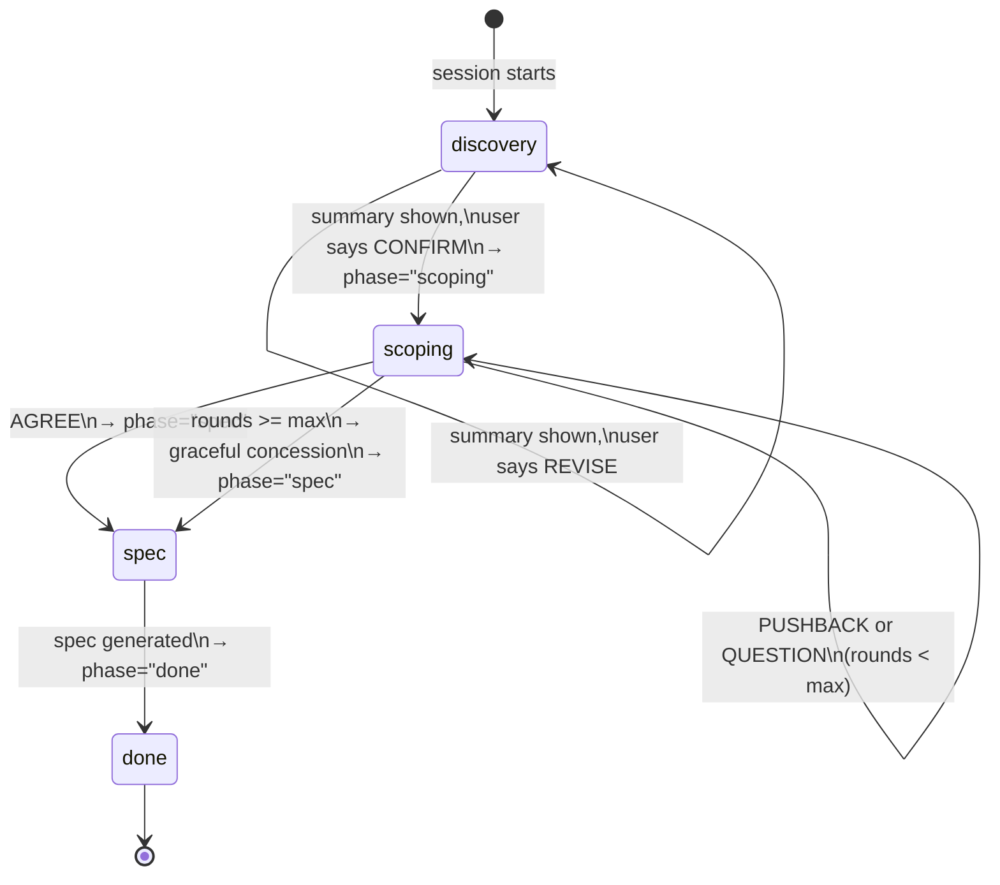
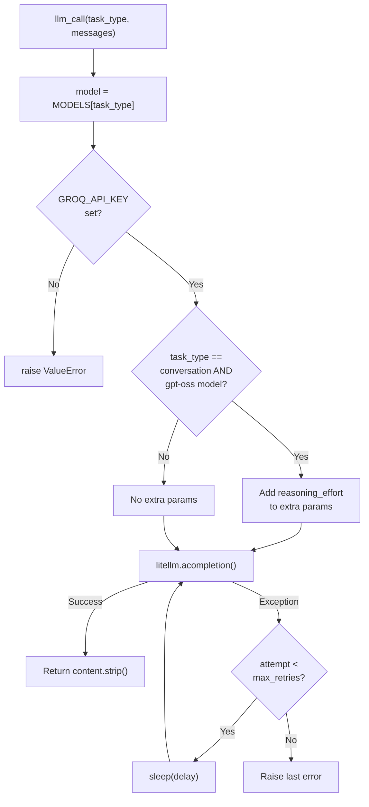
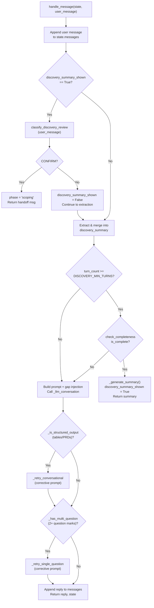
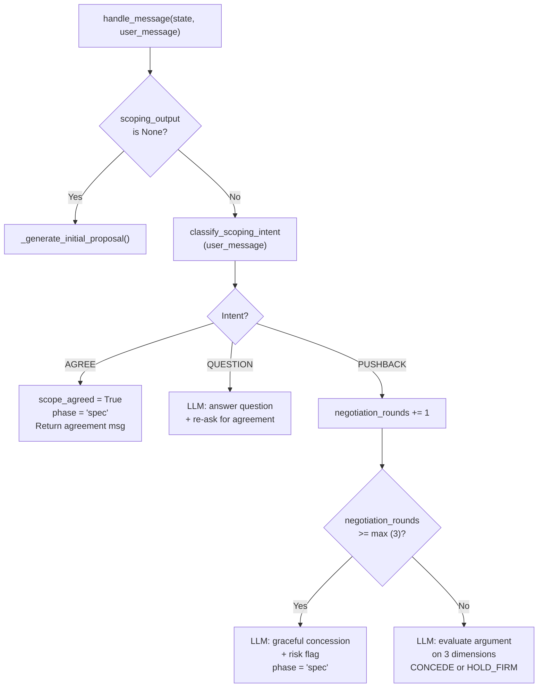
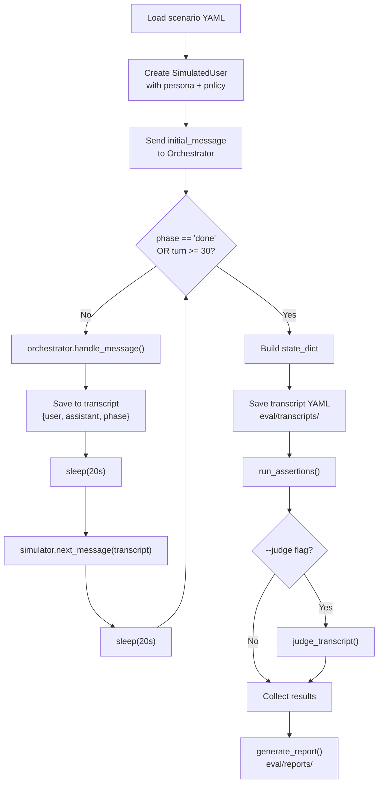

# Low Level Design: AI PM Agent

This document covers every component, schema, prompt, tool, and process in the system at implementation level. It is the companion to [HIGH_LEVEL_DESIGN.md](HIGH_LEVEL_DESIGN.md).

---

## 1. Data Schemas

All schemas are defined in `models/schemas.py` using Pydantic v2 `BaseModel`. They provide type safety, validation, and serialization.

### 1.1 DiscoverySummary

Structured output of the Discovery phase. Populated incrementally as the interview progresses.

| Field | Type | Default | Purpose |
|-------|------|---------|---------|
| `target_user` | `Optional[str]` | `None` | Who the product is for (persona, demographics, daily workflow) |
| `core_problem` | `Optional[str]` | `None` | The main pain point being solved |
| `current_alternatives` | `list[str]` | `[]` | What users use today (competitors, manual workarounds) |
| `why_now` | `Optional[str]` | `None` | Market timing, tech enablers, personal trigger |
| `feature_wishlist` | `list[str]` | `[]` | Features the founder envisions |
| `success_metric` | `Optional[str]` | `None` | How success will be measured (leading/lagging indicators) |
| `revenue_model` | `Optional[str]` | `None` | How it makes money (subscription, freemium, etc.) |
| `constraints` | `Optional[str]` | `None` | Budget, timeline, tech limits, regulatory |

**Mandatory fields for completeness:** `target_user` and `core_problem` must be non-empty for the discovery phase to be considered complete, regardless of overall score.

### 1.2 Feature

Single MVP feature with priority tier and optional RICE scoring.

| Field | Type | Default | Purpose |
|-------|------|---------|---------|
| `name` | `str` | required | Feature name |
| `description` | `str` | required | One-line description |
| `priority` | `Literal["P0","P1","P2"]` | required | Priority tier |
| `rice_reach` | `Optional[int]` | `None` | Users affected per period |
| `rice_impact` | `Optional[float]` | `None` | 3=massive, 2=high, 1=medium, 0.5=low, 0.25=minimal |
| `rice_confidence` | `Optional[float]` | `None` | 1.0=high, 0.8=medium, 0.5=low |
| `rice_effort` | `Optional[float]` | `None` | Person-weeks to build |
| `rice_score` | `Optional[float]` | `None` | Computed: `(Reach x Impact x Confidence) / Effort` |
| `phase` | `int` | `1` | Implementation phase (1, 2, or 3) |

### 1.3 CutFeature

Feature explicitly excluded from MVP with rationale.

| Field | Type | Purpose |
|-------|------|---------|
| `name` | `str` | Feature name |
| `reason_cut` | `str` | Why it was cut (e.g., "Adds 3 weeks, not core to value prop") |

### 1.4 ComparableProduct

Reference product discovered via web search.

| Field | Type | Default | Purpose |
|-------|------|---------|---------|
| `name` | `str` | required | Product name |
| `url` | `Optional[str]` | `None` | Product URL |
| `relevance` | `str` | required | Why it's relevant (snippet from search) |

### 1.5 ImplementationPhase

One phase of the 3-phase implementation plan.

| Field | Type | Default | Purpose |
|-------|------|---------|---------|
| `phase_number` | `int` | required | 1, 2, or 3 |
| `name` | `str` | required | E.g., "Core MVP", "Essential Additions", "Growth & Polish" |
| `goal` | `str` | required | What this phase proves or achieves |
| `estimated_weeks` | `str` | required | E.g., "1-2 weeks" |
| `features` | `list[str]` | `[]` | Feature names included in this phase |

### 1.6 ScopingOutput

Structured output of the Scoping phase.

| Field | Type | Default | Purpose |
|-------|------|---------|---------|
| `mvp_features` | `list[Feature]` | `[]` | Features included in MVP (P0/P1/P2, phased, RICE-scored) |
| `cut_features` | `list[CutFeature]` | `[]` | Features excluded with rationale |
| `comparable_products` | `list[ComparableProduct]` | `[]` | Products found via web search |
| `core_user_flow` | `Optional[str]` | `None` | The ONE flow that proves the idea works |
| `scope_rationale` | `Optional[str]` | `None` | Why this scope was chosen |
| `key_screens` | `list[str]` | `[]` | 3-5 key screens derived from core flow and P0 features |
| `implementation_phases` | `list[ImplementationPhase]` | `[]` | 3-phase build plan |

### 1.7 ConversationState

Global mutable state for the entire conversation. One instance per session.

| Field | Type | Default | Purpose |
|-------|------|---------|---------|
| `phase` | `Literal["discovery","scoping","spec","done"]` | `"discovery"` | Current pipeline phase |
| `messages` | `list[dict]` | `[]` | Full conversation history (`{role, content}`) |
| `discovery_summary` | `DiscoverySummary` | `DiscoverySummary()` | Incrementally extracted discovery data |
| `discovery_summary_shown` | `bool` | `False` | Whether the summary has been shown to user for confirmation |
| `scoping_output` | `Optional[ScopingOutput]` | `None` | `None` until scoping proposal is generated |
| `negotiation_rounds` | `int` | `0` | Number of pushback rounds in scoping |
| `max_negotiation_rounds` | `int` | `3` | Cap on argue-back rounds |
| `spec_markdown` | `Optional[str]` | `None` | Final spec document when phase is "done" |
| `scope_agreed` | `bool` | `False` | Whether user agreed to scope |
| `awaiting_scope_agreement` | `bool` | `False` | Whether scope proposal is pending user response |

**State machine semantics:**



---

## 2. Configuration

All constants live in `config.py`. No other file needs changes to swap models, adjust thresholds, or tune behavior.

| Constant | Value | Purpose |
|----------|-------|---------|
| `GROQ_API_KEY` | `os.getenv("GROQ_API_KEY", "")` | Groq API authentication |
| `MODEL_CONVERSATION` | `"groq/openai/gpt-oss-20b"` | Thinking model for Discovery + Scoping dialogue |
| `MODEL_SPEC` | `"groq/llama-3.3-70b-versatile"` | Large model for spec generation and LLM judge |
| `MODEL_EXTRACTION` | `"groq/llama-3.1-8b-instant"` | Fast model for extraction and classification |
| `MODELS` | `dict` mapping task types to model IDs | Routing lookup table |
| `REASONING_EFFORT` | `"medium"` | Reasoning depth for GPT-OSS (`"low"` / `"medium"` / `"high"`) |
| `INCLUDE_REASONING` | `False` | Whether to return reasoning tokens in response |
| `LLM_MAX_RETRIES` | `3` | Max retry attempts per LLM call |
| `LLM_RETRY_DELAYS` | `(1, 2, 4)` | Retry backoff delays in seconds |
| `DISCOVERY_COMPLETENESS_THRESHOLD` | `0.75` | Min score (6/8 fields) to consider discovery complete |
| `DISCOVERY_MANDATORY_FIELDS` | `("target_user", "core_problem")` | Must be filled regardless of overall score |
| `DISCOVERY_MIN_TURNS` | `4` | Min user messages before completeness check can trigger |
| `MAX_NEGOTIATION_ROUNDS` | `3` | Max argue-back rounds before graceful concession |
| `WEB_SEARCH_MAX_RESULTS` | `5` | Max DuckDuckGo results per search query |

**Tuning guidance:**
- Swap models: change `MODEL_CONVERSATION`, `MODEL_SPEC`, or `MODEL_EXTRACTION`. The `MODELS` dict references these constants.
- Increase reasoning quality: set `REASONING_EFFORT = "high"` (more latency, higher cost).
- Debug reasoning: set `INCLUDE_REASONING = True` to see the model's chain-of-thought.
- Adjust discovery depth: lower `DISCOVERY_COMPLETENESS_THRESHOLD` or `DISCOVERY_MIN_TURNS` for faster flow, raise for more thorough interviews.

---

## 3. LLM Call Mechanism

All LLM calls go through a single function in `models/llm.py`:

```python
async def llm_call(
    task_type: TaskType,  # "conversation" | "extraction" | "classification" | "spec"
    messages: list[dict[str, str]],
    **kwargs,
) -> str
```

### 3.1 Routing Logic

1. Look up model: `model = MODELS.get(task_type, MODELS["conversation"])`
2. Validate API key: raise `ValueError` if `GROQ_API_KEY` is empty.
3. Inject reasoning params: when `task_type == "conversation"` AND `"gpt-oss" in model`, add `reasoning_effort` and `allowed_openai_params=["reasoning_effort"]` to the LiteLLM call.
4. Call `litellm.acompletion(model, messages, api_key, **extra, **kwargs)`.
5. Return `response.choices[0].message.content.strip()`.

### 3.2 Retry Logic

On any exception, retry up to `LLM_MAX_RETRIES` (3) times with exponential backoff delays of `(1, 2, 4)` seconds. If all retries fail, raise the last error.



### 3.3 Error Handling

- **Empty content:** If `response.choices[0].message.content is None`, raises `ValueError("LLM returned empty content")` -- this triggers a retry.
- **Rate limits:** Caught by the generic exception handler and retried with backoff.
- **Missing API key:** Raises immediately (no retry).

---

## 4. Agent Implementations

### 4.1 BaseAgent (`agents/base.py`)

Provides a shared `_llm_conversation` method and defines the `handle_message` interface.

```python
class BaseAgent:
    async def _llm_conversation(self, messages: list[dict], system_prompt: str) -> str:
        full = [{"role": "system", "content": system_prompt}] + messages
        return await llm_call("conversation", full)

    async def handle_message(self, state: ConversationState, user_message: str) -> tuple[str, ConversationState]:
        raise NotImplementedError
```

All agents inherit from `BaseAgent`. The `_llm_conversation` method prepends the system prompt and routes to the conversation model (GPT-OSS 20B).

### 4.2 Discovery Agent (`agents/discovery.py`)

The Discovery Agent conducts a PM-style interview, extracts structured data, and checks for completeness.

#### Decision Tree



#### Key Functions

**`_build_prompt(state)`** -- Builds the system prompt dynamically:
- If this is the user's very first message (only 1 message in history), use `DISCOVERY_ASK_FOR_IDEA_PROMPT` (greeting + ask for idea).
- Otherwise, use `DISCOVERY_SYSTEM_PROMPT` + append a "Gaps remaining" section listing unfilled fields from `check_completeness()`.

**`_merge_extracted_into_summary(state, conv_text)`** -- Calls `extract_discovery_summary(conv_text)` via the extraction model (8B), then merges extracted fields into `state.discovery_summary` using these rules:
- Only overwrite if the extracted value is non-empty (not `None`, not `""`, not `[]`).
- Coerce types: string fields (`target_user`, `core_problem`, etc.) are cast to `str`; list fields (`current_alternatives`, `feature_wishlist`) are cast to `list[str]`.
- This ensures extraction never erases previously captured data.

**`_is_structured_output(reply)`** -- Heuristic to detect when the LLM generated a table or PRD instead of a conversational response:
- Returns `True` if reply contains `|---` (markdown table syntax).
- Returns `True` if reply starts with `# ` and contains "Product Requirements", "PRD", "Feature", or "Executive Summary" in the first 200 chars.

**`_has_multi_question(reply)`** -- Returns `True` if the reply contains 2 or more `?` characters. This catches the common LLM pattern of asking multiple questions in one message, violating the "one question at a time" rule.

**`_retry_conversational(conv, system)`** and **`_retry_single_question(conv, system)`** -- Append a corrective instruction to the system prompt and re-call the LLM. The corrective prompt tells the model to output only natural conversation (no tables) or ask only one question.

**`_generate_summary(state)`** -- When completeness passes, builds a conversation dump and calls `_llm_conversation` with `DISCOVERY_SUMMARY_PROMPT` to produce a formatted summary organized by the 8 aspects. Ends with "Does this capture everything correctly?"

#### Gap Labels

```python
GAP_LABELS = {
    "target_user": "target user / persona",
    "core_problem": "core problem / pain points",
    "current_alternatives": "current alternatives",
    "why_now": "why now",
    "feature_wishlist": "feature vision / wishlist",
    "success_metric": "success metric",
    "revenue_model": "revenue model",
    "constraints": "constraints",
}
```

These are appended to the system prompt so the LLM knows which aspects to probe next.

### 4.3 Scoping Agent (`agents/scoping.py`)

The Scoping Agent generates an MVP scope proposal, then handles argue-back negotiation.

#### Decision Tree



#### Initial Proposal Generation (`_generate_initial_proposal`)

1. **Web search:** Call `search_comparable_products(summary)` -- returns up to 5 DuckDuckGo results.
2. **Build context:** Format discovery summary + comparable product snippets into a context string.
3. **LLM proposal:** Call `_llm_conversation` with `SCOPING_SYSTEM_PROMPT` + context. The prompt instructs the model to: reference comparables, list features with RICE scores, propose 3 phases, cut features with rationale, identify the core user flow and key screens.
4. **Extract structured data:** Call `extract_scoping_output(reply)` to parse the natural language proposal into a `ScopingOutput` object.
5. **Merge search results:** Iterate through raw search results and add any that weren't already extracted by the LLM (deduplicate by name and URL). This ensures `comparable_products` is always populated when search succeeded, even if extraction missed them.

#### Argue-Back Loop

On PUSHBACK, the agent evaluates the user's argument on three dimensions (baked into the system prompt):

1. **Strength of argument** -- Is it logical and evidence-based?
2. **Impact on scope** -- How much does adding this feature increase build time?
3. **Core-ness to value prop** -- Is it central to the idea or nice-to-have?

The LLM then either:
- **CONCEDE:** Add the feature back (or move to higher priority) and explain why.
- **HOLD_FIRM:** Explain why the cut stands, with evidence.

After 3 rounds, the agent gracefully concedes with a risk flag: "I'll add it -- but flag that this stretches the MVP."

#### Intent Classification for Scoping

The scoping intent classifier (`classify_scoping_intent`) returns one of three labels:
- `"AGREE"` -- User accepts the scope.
- `"PUSHBACK"` -- User wants to change something.
- `"QUESTION"` -- User is asking a clarifying question.

Default on failure: `"PUSHBACK"` (safer to assume disagreement than to skip ahead).

### 4.4 Spec Writer Agent (`agents/spec_writer.py`)

Non-conversational. Single LLM call using the `spec` task type (70B model).

#### Flow

1. **Build context:** `_build_context(summary, scope)` assembles all discovery + scoping data:
   - Discovery fields (target_user, core_problem, etc.)
   - MVP features with phase and RICE scores
   - Cut features with rationale
   - Core user flow, key screens
   - Implementation phases with goals and weeks
   - The full `SPEC_TEMPLATE` as a structural reference
2. **LLM call:** `llm_call("spec", messages)` with `SPEC_WRITER_SYSTEM_PROMPT` as system prompt.
3. **Validation:** If the output doesn't contain `# Product Spec:` or `# ` (no markdown headers), fall back to `_fill_template_fallback`.
4. **Set state:** `state.spec_markdown = spec`, `state.phase = "done"`.

#### Template Fallback (`_fill_template_fallback`)

When the LLM output lacks proper structure, the fallback fills `SPEC_TEMPLATE` using Python `str.format()` with data from `DiscoverySummary` and `ScopingOutput`. The `_phase_content(scope, phase_num)` helper extracts per-phase data (name, weeks, goal, features, flow, screens).

#### RICE Summary Generation

`_rice_summary(scope)` builds a text summary of RICE scores for all MVP features that have scoring data. Format: `"Feature Name -- Reach: X, Impact: Y, Confidence: Z, Effort: W person-weeks, RICE score: N.NN"`.

---

## 5. Orchestrator (`orchestrator.py`)

The orchestrator is the central routing layer. It owns no LLM calls itself -- it delegates to agents and manages transitions.

### 5.1 Phase Routing

```python
class Orchestrator:
    def __init__(self):
        self.state = ConversationState()
        self.discovery_agent = DiscoveryAgent()
        self.scoping_agent = ScopingAgent()
        self.spec_writer_agent = SpecWriterAgent()

    async def handle_message(self, user_message, step_callback=None):
        # Skip prevention check
        # Route to active agent by state.phase
        # On phase transition: show handoff + trigger next agent
```

### 5.2 Skip Prevention

The function `_user_wants_to_skip(user_message, phase)` checks for phrases like:
- "just write the spec"
- "skip to spec"
- "skip discovery"
- "skip scoping"
- "go straight to spec"
- "only need the spec"
- "just give me the spec"

If detected (and phase is not "done"), returns `SKIP_PREVENTION_MESSAGE` instead of routing to an agent.

### 5.3 Handoff Messages

Deterministic text constants (no LLM generation):

- **discovery_to_scoping:** "Discovery is complete. I'm now handing off to the Scoping Agent, who will research comparable products, propose a phased MVP scope with RICE-scored features, and work with you to finalize the build plan."
- **scoping_to_spec:** "Scope is agreed. I'm now handing off to the Spec Writer, who will produce a detailed, phased product spec you can feed directly into a code generation tool."

### 5.4 Transition Mechanics

When the Discovery Agent sets `phase = "scoping"`:
1. Orchestrator shows handoff message.
2. Fires `step_callback("Researching comparable products...")` for UI progress.
3. Immediately calls `scoping_agent.handle_message(state, "")` to trigger the initial proposal.
4. Concatenates: `handoff_text + "\n\n---\n\n" + scoping_response`.
5. User sees both in one response.

Same pattern for scoping-to-spec: handoff message + spec writer output concatenated.

### 5.5 Done Phase

When `phase == "done"`, returns a static message: "We're done! You can download your spec below or start a new conversation."

---

## 6. Prompt Engineering

### 6.1 DISCOVERY_SYSTEM_PROMPT (`prompts/discovery.py`)

The core interview prompt. Encodes top-1% PM behavior.

**Key constraints:**
- "You are a warm, curious, rigorous product manager conducting a discovery interview."
- "Listen first. Your job is to ask and absorb, not to suggest."
- "Only offer suggestions when the user explicitly asks."
- "Ask ONE question at a time."
- "NEVER generate tables, feature lists, PRDs, or structured documents."

**Eight aspects covered** (with depth expectations and example probes):
1. Target user / persona -- "Who specifically? Demographics, role, team size, daily workflow."
2. Core problem / pain points -- "How often? How severe? What have they tried?"
3. Current alternatives -- "What do they use today? What's broken?"
4. Why now -- "Market timing, tech enablers, personal trigger?"
5. Feature vision / wishlist -- "Minimum viable vs. dream state?"
6. Success metric -- "Leading vs. lagging? Time horizon?"
7. Revenue model -- "Willingness to pay? Who pays?"
8. Constraints -- "Budget, timeline, tech limits, regulatory?"

**Gap injection:** The agent appends a "Gaps remaining" section dynamically listing unfilled aspects, so the LLM knows what to probe next.

### 6.2 DISCOVERY_ASK_FOR_IDEA_PROMPT (`prompts/discovery.py`)

Used when the user hasn't shared a product idea yet (e.g., first message is "hi").

"You are a warm, friendly product manager. The user has not yet shared a product idea. Respond naturally. Then ask them to tell you their product idea in a sentence or two. Do not ask about target user or any discovery aspect yet."

### 6.3 DISCOVERY_SUMMARY_PROMPT (`prompts/discovery.py`)

Used when completeness check passes to generate a user-facing summary.

"Based on everything discussed, generate a concise summary organized by: Target User, Core Problem, Current Alternatives, Why Now, Feature Vision, Success Metrics, Revenue Model, Constraints. Be factual. End with: 'Does this capture everything correctly? If so, I will hand this off to scoping.'"

### 6.4 SCOPING_SYSTEM_PROMPT (`prompts/scoping.py`)

Defines the scoping agent's opinionated PM personality.

**Key rules:**
- "Always cut more than the founder wants."
- "Social features, analytics dashboards, and admin panels are NEVER P0."
- "MVP must be buildable in 2-4 weeks by one developer."
- "Identify the ONE core user flow."

**RICE framework instructions:** Score every feature using Reach, Impact, Confidence, Effort. Formula: `(R x I x C) / E`.

**Phased planning:** Phase 1 (Core MVP, 1-2 weeks), Phase 2 (Essential additions, 1-2 weeks), Phase 3 (Growth & polish, 2-4 weeks). Consider technical dependencies.

**Argue-back rules:** Evaluate pushback on strength, impact, core-ness. Either CONCEDE or HOLD_FIRM. Max 3 rounds.

**First proposal must include:** reasoning sentence, comparable product references, P0/P1/P2 features with RICE, 3 phases with goals/weeks, cut features with reasons, core user flow, 3-5 key screens, build-order rationale.

### 6.5 SPEC_WRITER_SYSTEM_PROMPT (`prompts/spec_writer.py`)

"You are a product spec writer. You produce a single document, NOT conversational."

**Key rules:**
- Follow the template exactly.
- Structure by implementation phases (each independently buildable).
- Only include information explicitly discussed. No hallucination.
- "TBD -- needs further discovery" for missing sections.
- Include RICE scoring summary when available.

### 6.6 EXTRACTION_DISCOVERY_PROMPT (`prompts/extraction.py`)

Instructs the 8B model to extract JSON from conversation text with this schema:

```json
{
  "target_user": "string or null",
  "core_problem": "string or null",
  "current_alternatives": ["list of strings"],
  "why_now": "string or null",
  "feature_wishlist": ["list of strings"],
  "success_metric": "string or null",
  "revenue_model": "string or null",
  "constraints": "string or null"
}
```

Placeholder: `{conversation}` (replaced via `.replace()`, not `.format()`, to avoid KeyError from JSON braces).

### 6.7 EXTRACTION_SCOPING_PROMPT (`prompts/extraction.py`)

Instructs the 8B model to extract scoping data with a complex schema including:
- `mvp_features` with RICE fields and phase
- `cut_features` with reason
- `comparable_products` with URL
- `core_user_flow`, `scope_rationale`
- `key_screens` (list of strings)
- `implementation_phases` with phase_number, name, goal, estimated_weeks, features

Placeholder: `{proposal}`.

### 6.8 CLASSIFY_DISCOVERY_REVIEW_PROMPT (`prompts/extraction.py`)

Binary classifier: "Did the user confirm the discovery summary?"

"Reply with exactly one word: CONFIRM or REVISE."

Placeholder: `{user_response}`.

### 6.9 CLASSIFY_SCOPING_INTENT_PROMPT (`prompts/extraction.py`)

Ternary classifier: "Classify the user's response to the scope proposal."

"Reply with exactly one word: AGREE, PUSHBACK, or QUESTION."

Placeholder: `{user_response}`.

---

## 7. Tools

### 7.1 Completeness Checker (`tools/completeness.py`)

Pure Python, no LLM calls. Checks how much of `DiscoverySummary` is filled.

**Algorithm:**
1. Check 8 fields: `target_user`, `core_problem`, `current_alternatives`, `why_now`, `feature_wishlist`, `success_metric`, `revenue_model`, `constraints`.
2. A field is "filled" if: string is non-empty after `.strip()`, list has at least 1 element, value is not `None`.
3. `score = filled_count / 8`.
4. `is_complete = score >= 0.75 AND mandatory_met` (both `target_user` and `core_problem` filled).
5. Returns `(score, gaps, is_complete)` where `gaps` is the list of unfilled field names.

**Helper function:** `is_aspect_filled(summary, aspect_key)` -- checks a single field.

### 7.2 Extraction (`tools/extraction.py`)

Two extraction functions and a JSON parser helper.

**`_extract_json_block(text)`** -- Strips markdown code fences if present, then `json.loads()`. Returns `dict` or `None` on failure.

**`extract_discovery_summary(conversation_text)`:**
1. Build prompt: `EXTRACTION_DISCOVERY_PROMPT.replace("{conversation}", conversation_text)`.
2. Call `llm_call("extraction", ...)`.
3. Parse JSON via `_extract_json_block`.
4. Coerce types: string fields via `_str()`, list fields via `_str_list()`.
5. Return `DiscoverySummary(...)`.
6. On any exception: return empty `DiscoverySummary()` (graceful degradation).

**`extract_scoping_output(proposal_text)`:**
1. Build prompt: `EXTRACTION_SCOPING_PROMPT.replace("{proposal}", proposal_text)`.
2. Call `llm_call("extraction", ...)`.
3. Parse JSON, then manually construct `Feature`, `CutFeature`, `ComparableProduct`, `ImplementationPhase` objects with validation (e.g., `priority in ("P0","P1","P2")`, `phase in (1,2,3)`).
4. Return `ScopingOutput(...)`.
5. On any exception: return empty `ScopingOutput()`.

**Why `.replace()` instead of `.format()`:** The extraction prompts contain literal JSON braces (`{`, `}`). Python's `str.format()` interprets these as format placeholders, causing `KeyError`. Using `.replace("{conversation}", text)` avoids this entirely.

### 7.3 Intent Classification (`tools/intent.py`)

**`classify_discovery_review(user_response) -> bool`:**
1. Format prompt with user's response.
2. Call `llm_call("classification", ...)`.
3. Return `True` if "CONFIRM" appears in the response (case-insensitive).
4. Default on failure: `False` (don't advance prematurely).

**`classify_scoping_intent(user_response) -> str`:**
1. Format prompt with user's response.
2. Call `llm_call("classification", ...)`.
3. Parse for "AGREE", "PUSHBACK", or "QUESTION".
4. Default on failure: `"PUSHBACK"` (safer to assume disagreement).

### 7.4 Web Search (`tools/web_search.py`)

Uses `duckduckgo-search` library (Python 3.9 compatible; the newer `ddgs` package requires 3.10+).

**Query construction:** `"{core_problem} app for {target_user}"` with fallbacks ("product" and "users" if fields are empty).

**Execution:**
1. `_run_sync_search(query, max_results)` -- Sync function, runs DuckDuckGo search.
2. Retry logic: up to 3 attempts with 5-second delay between retries on empty results or exceptions. DuckDuckGo rate-limits after a few calls in quick succession.
3. `search_comparable_products(discovery_summary)` -- Async wrapper that runs the sync search in `run_in_executor` to avoid blocking the event loop.

**Deprecation warning suppression:** The package emits a `RuntimeWarning` about being renamed to `ddgs`. Suppressed via `warnings.filterwarnings("ignore", ...)`.

Returns: `list[dict]` with keys `title`, `href`, `body` (DuckDuckGo text result format).

### 7.5 Spec Template (`tools/templates.py`)

The `SPEC_TEMPLATE` is a Markdown string with `str.format()` placeholders:

| Placeholder | Source |
|-------------|--------|
| `{product_name}` | `summary.core_problem[:50]` |
| `{problem_statement}` | `summary.core_problem` |
| `{target_user_persona}` | `summary.target_user` |
| `{comparable_products}` | Formatted list from `scope.comparable_products` |
| `{phase_N_name}`, `{phase_N_weeks}`, `{phase_N_goal}` | From `scope.implementation_phases[N-1]` |
| `{phase_N_features}` | Formatted feature list for phase N |
| `{phase_1_flow}` | `scope.core_user_flow` |
| `{phase_1_screens}`, `{phase_2_screens}` | From `scope.key_screens` |
| `{cut_features}` | Formatted list from `scope.cut_features` |
| `{rice_summary}` | Generated by `_rice_summary(scope)` |
| `{open_questions_risks}` | "TBD -- needs further discovery" (fallback) |
| `{technical_considerations}` | "TBD -- needs further discovery" (fallback) |

The template structure:
- `# Product Spec: {product_name}`
- `## Problem Statement`
- `## Target User Persona`
- `## Comparable Products`
- `## Implementation Plan` → Phase 1, 2, 3 with Features, Core User Flow, Key Screens
- `## Cut Features (with rationale)`
- `## RICE Scoring Summary`
- `## Open Questions & Risks`
- `## Technical Considerations`

---

## 8. Chainlit UI Integration (`app.py`)

### 8.1 Session Management

```python
@cl.on_chat_start
async def start():
    orchestrator = Orchestrator()
    cl.user_session.set("orchestrator", orchestrator)
    # Send welcome message
```

Each chat session gets its own `Orchestrator` instance stored in Chainlit's session. State is in-memory only.

### 8.2 Message Routing

```python
@cl.on_message
async def main(message: cl.Message):
    orchestrator = cl.user_session.get("orchestrator")
    # Route to orchestrator with step callback
    # Send response with author label
```

### 8.3 Author Labels

Messages are labeled with the active agent's name:

```python
PHASE_AUTHOR = {
    "discovery": "Discovery",
    "scoping": "Scoping",
    "spec": "Spec Writer",
    "done": "PM",
}
```

### 8.4 Step Callbacks

During phase transitions, the orchestrator fires `step_callback(name)` which sends a progress message like "Researching comparable products and preparing scope..." with author "PM".

### 8.5 Spec Download

When `state.phase == "done"` and `spec_markdown` is set:
```python
elements = [cl.File(name="product_spec.md", content=spec_md.encode("utf-8"), display="inline")]
await cl.Message(content="Download your product spec:", elements=elements).send()
```

### 8.6 Error Handling

- **Missing API key:** Caught via `ValueError` containing "GROQ_API_KEY" -- sends a specific error message.
- **All other exceptions:** Caught generically -- sends "I'm having trouble thinking right now. Please try again."
- **Lost session:** If `orchestrator is None`, asks user to refresh.

---

## 9. Evaluation Subsystem

### 9.1 Runner (`eval/runner.py`)

**CLI:**
```bash
python eval/runner.py            # Layer 2 only
python eval/runner.py --judge    # Layer 2 + Layer 3
```

**Flow per scenario:**



**Constants:**
- `SCENARIOS_DIR`: `eval/scenarios/`
- `TRANSCRIPTS_DIR`: `eval/transcripts/`
- `TURN_DELAY_SECONDS`: 20 (Groq free-tier TPM rate limit)

**`state_dict` structure (built after conversation):**
```python
{
    "phase": str,
    "reached_done": bool,
    "turn_count": int,
    "phases_visited": list[str],
    "discovery_summary": dict,
    "scoping_output": dict | None,
    "spec_length": int,
    "spec_markdown": str,
    "negotiation_rounds": int,
}
```

**Rate limiting:** Two `sleep(20s)` calls per turn -- one before the orchestrator call, one before the simulator call. Both consume the same Groq TPM budget.

### 9.2 Simulated User (`eval/simulated_user.py`)

LLM-powered founder simulator that generates contextual responses based on persona and message policy.

**Four message policies:**

| Policy | Behavior |
|--------|----------|
| `minimal` | One or two word replies. Only expand when explicitly probed. |
| `expansive` | Full, detailed answers. Accept proposals readily. Confirm quickly. |
| `pushback` | Cooperative during discovery. Push back hard on scope cuts during scoping. |
| `pivot` | Start with initial idea. After 3-4 exchanges, shift to a related but different idea. |

**System prompt construction:** Combines persona text + policy instructions + meta-instructions ("Respond with ONLY the founder's next message, no labels, no meta-commentary").

**Conversation perspective inversion:** The transcript stores `{user: founder_msg, assistant: agent_msg}`. For the simulator's LLM call, roles are inverted: the agent's messages become `"user"` (input to the founder) and the founder's prior messages become `"assistant"` (the simulator's own output). This lets the LLM naturally continue generating as the founder.

**Model used:** `conversation` task type (GPT-OSS 20B) for realistic, contextual responses.

### 9.3 Assertions (`eval/assertions.py`)

Deterministic pass/fail checks. Zero LLM cost.

#### Universal Assertions (22 checks, all scenarios)

**Pipeline (6):**

| Assertion | Logic | What It Catches |
|-----------|-------|-----------------|
| `reached_done` | `state.phase == "done"` | Pipeline crashed or got stuck |
| `reached_scoping` | `"scoping" in phases_visited` | Never left discovery |
| `spec_generated` | `spec_length > 0` | Spec writer produced nothing |
| `all_phases_visited` | `["discovery","scoping","done"]` present and in order | Phases skipped or out of order |
| `no_errors` | No `phase == "error"` or `[ERROR` in assistant text | LLM or runtime errors |
| `no_sim_errors` | No `[SIM ERROR` in user messages | Simulator rate-limit crashes |

Note: The expected phases are `["discovery","scoping","done"]` not `["discovery","scoping","spec"]` because `spec` is transient -- the orchestrator chains the spec writer immediately, and it sets `phase = "done"` in the same turn.

**Discovery Quality (5):**

| Assertion | Logic | What It Catches |
|-----------|-------|-----------------|
| `target_user_extracted` | `discovery.target_user` is non-empty (excluding null-like strings) | Extraction failure on mandatory field |
| `core_problem_extracted` | `discovery.core_problem` is non-empty | Extraction failure on mandatory field |
| `discovery_completeness` | >= 6 of 8 discovery fields filled | Shallow interview |
| `min_discovery_turns` | >= 4 turns in discovery phase | Premature discovery completion |
| `no_multi_question` | No discovery turn with 2+ `?` in assistant text | Agent asking multiple questions at once |

**Scoping Quality (7):**

| Assertion | Logic | What It Catches |
|-----------|-------|-----------------|
| `has_p0_features` | At least one P0 feature in `mvp_features` | No core features identified |
| `rice_scores_present` | All P0 features have non-null `rice_score` | Extraction failed to capture RICE |
| `has_cut_features` | >= 1 cut feature | Agent didn't cut anything |
| `has_comparable_products` | >= 1 comparable product | Web search returned nothing |
| `social_not_p0` | No P0 feature name/description contains "social", "analytics", "admin", "dashboard" | Hard rule violation |
| `has_core_user_flow` | `core_user_flow` is non-empty | Missing core deliverable |
| `phase1_within_4_weeks` | Phase 1 upper bound estimate <= 4 weeks | Scope too large for MVP |

**Spec Quality (4):**

| Assertion | Logic | What It Catches |
|-----------|-------|-----------------|
| `spec_no_hallucination_check` | First 40 chars of `target_user` appear in spec (case-insensitive) | Spec doesn't match discovery (weak proxy) |
| `spec_has_sections` | >= 2 of expected `##` headers present | Unstructured or empty spec |
| `spec_no_empty_tbd` | <= 3 "TBD" occurrences | Too many unfilled sections |
| `spec_problem_statement_filled` | `## Problem` section doesn't contain "tbd" | Critical section left empty |

#### Scenario-Specific Assertions (5, one per scenario)

| Scenario | Assertion | Logic |
|----------|-----------|-------|
| `over_scoper` | `features_cut` | >= 3 features cut (aggressive cutting of large wishlist) |
| `clear_thinker` | `finished_efficiently` | <= 15 turns (well-defined idea shouldn't drag) |
| `arguer` | `negotiation_rounds_nonzero` | `negotiation_rounds > 0` (pushback was registered) |
| `pivoter` | `handled_pivot` | >= 6 turns (enough to handle a mid-stream pivot) |
| `vague_founder` | `probed_vague_answers` | >= 5 discovery turns (vague answers require more probing) |

#### Null-String Handling

The `_nonempty()` helper rejects literal placeholder strings the LLM sometimes outputs instead of `None`:

```python
_NULL_STRINGS = frozenset({
    "null", "none", "n/a", "not specified", "not stated", "not provided",
    "tbd", "unknown", "unspecified",
})
```

### 9.4 LLM Judge (`eval/judge.py`)

Layer 3: qualitative scoring by a 70B model.

**Model:** Uses `task_type="spec"` (Llama 3.3 70B). Same model that generates specs. Known limitation -- future improvement: use a different provider for judging to reduce self-bias.

**Prompt structure:**
1. **System prompt:** Expert PM evaluator. Score 1-5. Provide reasoning BEFORE score. Output JSON only.
2. **User message:** Scenario info + full transcript + final state summary + spec markdown + full rubric text.

**JSON parsing:**
1. First attempt: pass `response_format={"type": "json_object"}` to force JSON.
2. Strip markdown fences if present.
3. Validate: clamp scores to [1, 5], handle `null` for N/A dimensions.
4. On parse failure: retry once with an explicit "respond only in valid JSON" nudge.

**Output shape:**
```python
{
    "discovery_depth":          {"reasoning": str, "score": int | None},
    "conversation_naturalness": {"reasoning": str, "score": int | None},
    "scoping_quality":          {"reasoning": str, "score": int | None},
    "spec_accuracy":            {"reasoning": str, "score": int | None},
    "argue_back_quality":       {"reasoning": str, "score": int | None},
}
```

**Overall score:** `compute_overall(scores)` sums non-null scores. Max possible = 5 x (number of non-null dimensions).

### 9.5 Rubric (`eval/rubric.py`)

Five dimensions, each scored 1-5:

| Dimension | What It Measures |
|-----------|-----------------|
| `discovery_depth` | Right questions asked; vague answers probed; key areas covered. 1=missed most, 5=thorough. |
| `conversation_naturalness` | Human PM feel vs. form feel. One question at a time, warm, conversational. 1=robotic, 5=real PM. |
| `scoping_quality` | Correct P0s; justified cuts; MVP buildable in 2-4 weeks; social/dashboards not P0. 1=poor, 5=clear MVP. |
| `spec_accuracy` | Spec matches discussion; no hallucinations; TBD where unknown. 1=wrong, 5=accurate. |
| `argue_back_quality` | Evaluates pushback on strength/impact/core-ness; concedes or holds firm. 1=ignores, 5=nuanced. |

### 9.6 Reports (`eval/report.py`)

**Timestamped report (`eval/reports/eval_YYYYMMDD_HHMMSS.md`):**
- Run metadata: models, eval layers, scenarios count, timestamp.
- Summary table: per-scenario assertion pass rate, turns, reached done, spec length, transcript link; with judge: overall judge score.
- Layer 2 detail: full pass/fail for each assertion per scenario.
- Layer 3 detail (if `--judge`): per-dimension scores with reasoning snippets.

**Results summary (`eval/results.md`, overwritten each `--judge` run):**
- Comparison table: scenarios as rows, columns = assertions pass rate + each judge dimension + overall.
- Dimension reference table.

### 9.7 Scenarios (`eval/scenarios/*.yaml`)

Each scenario YAML defines:

```yaml
name: string
description: string
persona: string (multi-line)
initial_message: string
message_policy: "minimal" | "expansive" | "pushback" | "pivot"
```

| Scenario | Initial Message Summary | Persona | Policy |
|----------|------------------------|---------|--------|
| `vague_founder` | Vague idea, minimal details | Gives one-word answers, needs probing | `minimal` |
| `over_scoper` | Feature-heavy idea with 15+ items | Lists many features, accepts cuts | `expansive` |
| `clear_thinker` | Well-defined product concept | Clear, detailed, cooperative | `expansive` |
| `arguer` | Clear idea, strong opinions | Pushes back hard on feature cuts | `pushback` |
| `pivoter` | Starts with one idea, then pivots | Changes direction mid-conversation | `pivot` |

---

## 10. Error Handling Strategy

### 10.1 LLM Call Failures

- **Retry with backoff:** 3 attempts with 1s, 2s, 4s delays.
- **Empty content:** Treated as failure, triggers retry.
- **Final failure:** Exception propagates to orchestrator, then to `app.py` which shows "I'm having trouble thinking right now."

### 10.2 Extraction Failures

- Both `extract_discovery_summary` and `extract_scoping_output` wrap their entire logic in `try/except`.
- On any failure (JSON parse error, schema mismatch, LLM error), return an empty schema (`DiscoverySummary()` or `ScopingOutput()`).
- The agent continues normally -- extraction enriches state but never gates the conversation flow.

### 10.3 Web Search Failures

- `_run_sync_search` retries up to 3 times with 5-second delays.
- On complete failure, returns empty list `[]`.
- Scoping agent continues without comparable products -- the proposal is generated from discovery data alone.
- The `has_comparable_products` assertion will flag this in eval.

### 10.4 Output Validation

- **Structured output rejection:** If Discovery Agent's reply contains markdown tables or PRD headers, retry with a corrective prompt.
- **Multi-question rejection:** If reply has 2+ question marks, retry with instruction to ask only one question.
- One retry per validation type. If the retry also fails validation, the reply is used as-is.

### 10.5 Intent Classification Defaults

- `classify_discovery_review`: defaults to `False` (REVISE) on failure -- prevents premature handoff.
- `classify_scoping_intent`: defaults to `"PUSHBACK"` on failure -- prevents premature spec generation.

### 10.6 Skip Prevention

If user sends "just write the spec" or similar phrases, the orchestrator returns a gentle redirect without forwarding to any agent. This prevents bypassing the discovery/scoping process.

### 10.7 Prompt Template Safety

Extraction prompts use `.replace("{placeholder}", value)` instead of `.format(placeholder=value)` to avoid `KeyError` from literal JSON braces in the prompt templates.

### 10.8 Eval-Specific Error Handling

- **Rate limit management:** 20-second delays between turns and between scenarios.
- **Simulator errors:** Captured as `[SIM ERROR: ...]` in the transcript; `no_sim_errors` assertion catches these.
- **SSL/resource leak suppression:** `warnings.filterwarnings("ignore", category=ResourceWarning)` at runner startup, plus `await asyncio.sleep(0.5)` before exit to let pending transport cleanups finish.
- **DuckDuckGo deprecation warning:** Suppressed via `warnings.filterwarnings("ignore", ...)`.
