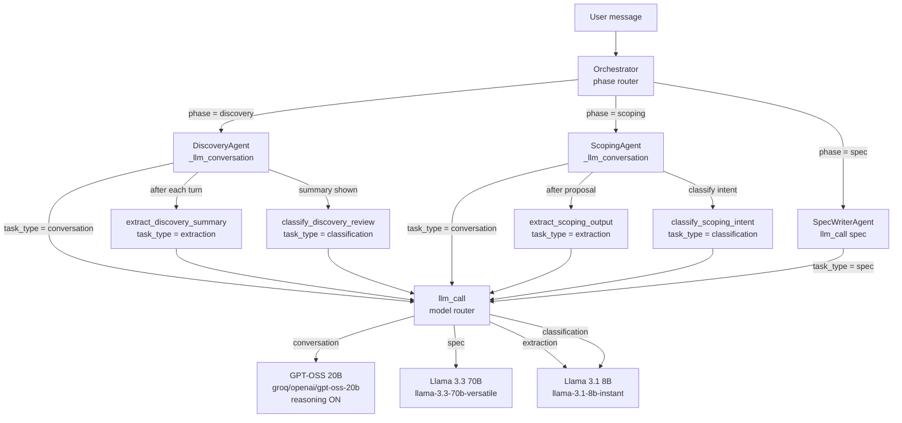

# Model Architecture: Mixture of Experts and Smart Routing

This document describes the model selection, Mixture of Experts (MoE) architecture, routing mechanism, and tuning options for the AI PM Agent.

---

## Model Selection

Each task type is assigned a model chosen for cost, speed, and quality.

| Task type | Model | Model ID | Rationale |
|-----------|--------|----------------------------------|--------------------------------------------------------------------------------------------------------|
| **conversation** | GPT-OSS 20B (reasoning) | `groq/openai/gpt-oss-20b` | Cheapest thinking model on Groq; emits explicit reasoning; used for nuanced PM dialogue in Discovery and Scoping. |
| **spec** | Llama 3.3 70B | `groq/llama-3.3-70b-versatile` | Best long-form structured writing; one-shot spec generation; quality over speed. |
| **extraction** | Llama 3.1 8B | `groq/llama-3.1-8b-instant` | JSON schema-filling is classification-grade; fast and cheap. |
| **classification** | Llama 3.1 8B | `groq/llama-3.1-8b-instant` | Small label set (CONFIRM/REVISE for discovery review, AGREE/PUSHBACK/QUESTION for scoping); 8B is sufficient. |

### Why each model

- **Conversation (GPT-OSS 20B):** Discovery and Scoping require probing, pushback, and coherent multi-turn dialogue. A reasoning model produces a visible “thinking” phase and better coherence than a single fast forward pass. GPT-OSS 20B is the cheapest reasoning option on Groq and keeps latency reasonable.
- **Spec (Llama 3.3 70B):** Spec generation is a single long-form call. We prioritize output quality and template adherence; the 70B model is used only here.
- **Extraction & classification (Llama 3.1 8B):** Both are structured, schema-bound tasks (JSON extraction and intent labels). A small fast model reduces cost and latency without sacrificing reliability.

---

## Cost and Speed Comparison

Approximate Groq pricing and throughput (per 1M tokens unless noted):

| Model | Input | Output | Speed (t/s) | Use |
|-------|--------|--------|-------------|-----|
| groq/openai/gpt-oss-20b | $0.075 | $0.30 | ~1000 | conversation |
| groq/llama-3.3-70b-versatile | $0.59 | $0.79 | ~280 | spec |
| groq/llama-3.1-8b-instant | $0.05 | $0.08 | ~560 | extraction, classification |

Most turns use one 8B call (classification or extraction) and one 20B call (conversation); only the final spec uses 70B. This keeps per-conversation cost low while improving dialogue quality via reasoning.

---

## Mixture of Experts Architecture

The system uses a **task-based MoE**: one model per task type, selected in code by the caller (agents and tools) via `llm_call(task_type, messages, ...)`. There is no dynamic router; routing is static and configured in `config.py`.

### Benefits

- **Efficiency:** Heavy models (70B) only for spec; conversation uses a cheaper reasoning model; extraction and classification use the smallest model.
- **Quality:** Reasoning on conversation improves coherence and pushback; 70B keeps spec quality high.
- **Simplicity:** Routing is a single lookup in `config.MODELS`; no extra services or routers.
- **Tunability:** Changing models or reasoning effort is done in `config.py` only.

---

## Routing Mechanism

1. **Call site:** Every LLM use goes through `llm_call(task_type, messages, **kwargs)` in `models/llm.py`. Callers pass one of: `conversation`, `extraction`, `classification`, `spec`.
2. **Model lookup:** `model = MODELS.get(task_type, MODELS["conversation"])` in `llm.py` selects the LiteLLM model name from `config.MODELS`.
3. **Reasoning params:** When `task_type == "conversation"` and the selected model is a Groq GPT-OSS model (e.g. `groq/openai/gpt-oss-20b`), `llm_call` adds `reasoning_effort` and `include_reasoning` from config to the LiteLLM call. No other task types get these params.
4. **Execution:** LiteLLM calls the Groq API with the chosen model and params; retries and error handling are unchanged.

No agent, prompt, or schema code needs to know which model is used; only the task type is fixed at each call site.

---

## Reasoning Effort (GPT-OSS)

For the conversation model (`groq/openai/gpt-oss-20b`), two config knobs control reasoning:

- **`REASONING_EFFORT`** (`config.py`): `"low"` | `"medium"` | `"high"`. Higher values use more reasoning tokens and can improve answer quality at the cost of latency and output cost.
- **`INCLUDE_REASONING`**: If `True`, the API returns the model’s reasoning (e.g. in a `reasoning` field or in content). Useful for debugging or to surface “thinking” in the UI. If `False`, reasoning is still performed but not returned.

Default is `REASONING_EFFORT = "medium"` and `INCLUDE_REASONING = False` for a balance of speed and quality without extra tokens in the response.

---

## Tuning

- **Swap models:** Edit `config.py`. Change `MODEL_CONVERSATION`, `MODEL_SPEC`, or `MODEL_EXTRACTION` and ensure `MODELS` references the correct constants. No code changes elsewhere are required.
- **More/less reasoning:** Adjust `REASONING_EFFORT`; set `INCLUDE_REASONING = True` to inspect or display reasoning.
- **Fallback:** If a model is unavailable, the existing retry logic in `llm_call` applies; for permanent substitution, point the task’s entry in `MODELS` to another Groq model ID supported by LiteLLM.
