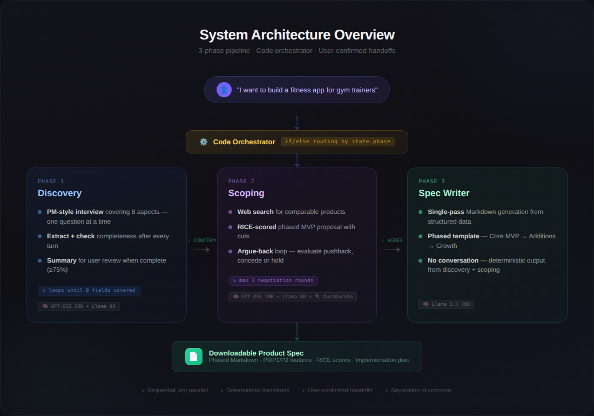
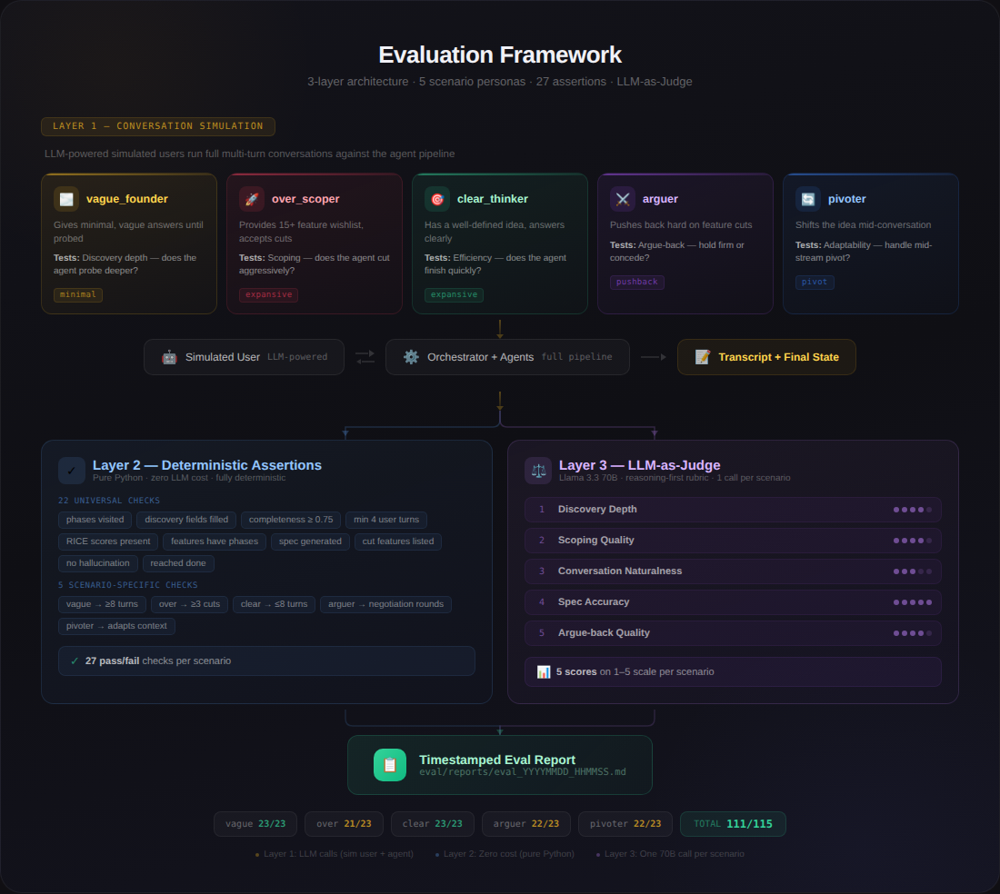

# Vibe-PM

**One conversation replaces weeks of PM process -- from vague idea to phased, prioritized product spec.**

Vibe-PM is an AI product-manager agent that turns rough product ideas into structured, developer-ready specs through a 3-phase conversational pipeline. It conducts a PM-style discovery interview, proposes a RICE-scored MVP scope backed by competitive web research, negotiates feature cuts with the founder, and produces a phased Markdown spec you can hand to a developer or feed into an AI code-generation tool.

Built with open-source models only. No GPT-4, no Claude, no vendor lock-in.

Created by **[Vinayak Rastogi](https://www.linkedin.com/in/vinayak1998/)**.

---

## Architecture



---

## Key Design Decisions

- **3 specialized agents, not 1 mega-prompt.** Each phase gets its own agent with a focused prompt and dedicated model. Discovery interviews better when it isn't also thinking about RICE scores.
- **Code orchestrator, not LLM orchestrator.** Phase transitions are deterministic if/else routing with user-confirmed handoffs. No hallucinated transitions, fully debuggable.
- **Mixture of Experts model routing.** Three open-source models assigned by task type -- a 20B reasoning model for conversation, a 70B model for spec writing, and an 8B model for extraction/classification. Most turns cost fractions of a cent.
- **Open-source models only.** Zero vendor lock-in. Swap Groq for Together AI or any LiteLLM-compatible provider by changing one line in `config.py`.
- **3-layer eval framework.** LLM-simulated founders (5 personas), 27 deterministic assertions, and an LLM-as-Judge scoring 5 rubric dimensions. Eval runs end-to-end with one command.
- **No frameworks.** No LangChain, no LangGraph. Plain Python + Pydantic. The entire orchestrator is ~80 lines of if/else.

---

## How It Works

### Phase 1: Discovery

The Discovery Agent conducts a PM-style interview covering 8 aspects: target user, core problem, current alternatives, why now, feature wishlist, success metric, revenue model, and constraints. It asks one question at a time, probes vague answers, and rejects attempts to generate tables or PRDs. After each turn, it extracts structured data and checks completeness. When 6/8 fields are filled and mandatory fields (target user + core problem) are present, it generates a summary for user confirmation before handing off.

### Phase 2: Scoping

The Scoping Agent searches DuckDuckGo for comparable products, then proposes a RICE-scored, phased MVP scope. It cuts aggressively -- social features, analytics dashboards, and admin panels are never P0. The MVP must be buildable in 2-4 weeks by one developer. If the founder pushes back on cuts, the agent evaluates the argument on strength, impact, and core-ness, then either concedes or holds firm. After 3 rounds of pushback, it gracefully concedes with a risk flag.

### Phase 3: Spec Writer

The Spec Writer generates a single Markdown document from the structured discovery and scoping data. The spec is organized by implementation phase (Phase 1: Core MVP, Phase 2: Essential Additions, Phase 3: Growth & Polish), with each phase independently buildable. Includes RICE scoring summary, cut features with rationale, comparable products, and open questions.

---

## Model Routing (Mixture of Experts)

| Task | Model | Why |
|------|-------|-----|
| **Conversation** (Discovery + Scoping dialogue) | GPT-OSS 20B | Cheapest reasoning model on Groq. Chain-of-thought improves interview coherence and argue-back quality. |
| **Spec generation** | Llama 3.3 70B | Best long-form structured writing. Used only once per conversation. |
| **Extraction + Classification** | Llama 3.1 8B | JSON schema-filling and intent labels (CONFIRM/REVISE, AGREE/PUSHBACK/QUESTION). Fast, cheap, sufficient. |

All models run on [Groq](https://groq.com/) via [LiteLLM](https://github.com/BerriAI/litellm). Swap providers by editing `config.py`.

---

## Eval Results

The eval framework runs 5 simulated founder personas through the full pipeline and scores the output with 27 deterministic assertions + an LLM judge across 5 dimensions.



**Latest run (Mar 9, 2026):**

| Scenario | Assertions | Discovery | Naturalness | Scoping | Spec | Argue-back | Overall |
|----------|-----------|-----------|-------------|---------|------|------------|---------|
| vague_founder | 21/23 | 5/5 | 5/5 | 5/5 | 5/5 | N/A | 20/20 |
| over_scoper | 22/23 | 4/5 | 5/5 | 4/5 | 5/5 | N/A | 18/20 |
| clear_thinker | 23/23 | 5/5 | 5/5 | 5/5 | 5/5 | N/A | 20/20 |
| arguer | 22/23 | 4/5 | 4/5 | 4/5 | 4/5 | 5/5 | 21/25 |
| pivoter | 21/23 | 4/5 | 4/5 | 4/5 | 5/5 | N/A | 17/20 |

109/115 assertions passed. Average judge score: 4.5/5 across applicable dimensions.

---

## Project Structure

```
Vibe-PM/
├── app.py                      # Chainlit entry point: sessions, message routing, spec download
├── orchestrator.py             # Code orchestrator: phase routing, handoffs, skip prevention
├── config.py                   # All model names, thresholds, constants (single tuning point)
├── requirements.txt            # Python dependencies
├── .env.example                # Template for GROQ_API_KEY
│
├── agents/
│   ├── base.py                 # BaseAgent: shared _llm_conversation() method
│   ├── discovery.py            # Discovery Agent: interview, extraction, completeness, validation
│   ├── scoping.py              # Scoping Agent: web search, RICE proposal, argue-back loop
│   └── spec_writer.py          # Spec Writer: single-pass phased Markdown generation
│
├── models/
│   ├── llm.py                  # LiteLLM wrapper: task-based MoE routing, retries
│   └── schemas.py              # Pydantic models: DiscoverySummary, ScopingOutput, ConversationState
│
├── prompts/
│   ├── discovery.py            # Discovery SOP (top-1% PM interview), summary prompt
│   ├── scoping.py              # Scoping system prompt (RICE, phased planning, argue-back)
│   ├── spec_writer.py          # Spec writer prompt (template adherence, no hallucination)
│   └── extraction.py           # Extraction schemas + intent classification prompts
│
├── tools/
│   ├── completeness.py         # Discovery completeness scorer (8 fields, threshold, mandatory)
│   ├── extraction.py           # JSON extraction for DiscoverySummary and ScopingOutput
│   ├── intent.py               # Intent classifiers: CONFIRM/REVISE, AGREE/PUSHBACK/QUESTION
│   ├── web_search.py           # DuckDuckGo comparable product search with retry
│   └── templates.py            # Phased spec Markdown template with all placeholders
│
├── eval/
│   ├── runner.py               # Eval entrypoint: runs conversations, assertions, optional judge
│   ├── simulated_user.py       # LLM-powered founder simulator (4 message policies)
│   ├── assertions.py           # Layer 2: 27 deterministic pass/fail checks
│   ├── judge.py                # Layer 3: LLM-as-Judge (5 rubric dimensions, 1-5 scale)
│   ├── rubric.py               # Rubric dimensions and descriptions
│   ├── report.py               # Timestamped report and results.md generation
│   ├── scenarios/              # 5 YAML scenario definitions (personas + policies)
│   ├── transcripts/            # Saved conversation transcripts (gitignored)
│   └── reports/                # Timestamped eval reports (gitignored)
│
├── HIGH_LEVEL_DESIGN.md        # Architecture, data flow, design decisions, eval overview
├── LOW_LEVEL_DESIGN.md         # Every schema, prompt, tool, agent flow, assertion
├── DECISION_LOG.md             # Chronological log of all architectural decisions
└── LICENSE                     # MIT License
```

---

## Quick Start

### Prerequisites

- Python 3.9+
- A [Groq API key](https://console.groq.com/) (free tier works)

### Setup

```bash
git clone https://github.com/vinayak1998/Vibe-PM.git
cd Vibe-PM
python -m venv .venv
source .venv/bin/activate   # Windows: .venv\Scripts\activate
pip install -r requirements.txt
cp .env.example .env
# Edit .env and set GROQ_API_KEY=your_key_here
```

### Run the App

```bash
chainlit run app.py
```

Open the URL shown in terminal (typically http://localhost:8000). Start chatting with your product idea.

---

## Running Evals

```bash
python eval/runner.py              # Layer 1 + 2: simulated conversations + assertions (fast, free)
python eval/runner.py --judge      # Layer 1 + 2 + 3: adds LLM-as-Judge scoring (uses 70B model)
```

Reports are saved to `eval/reports/`. Transcripts are saved to `eval/transcripts/`. When `--judge` is used, `eval/results.md` is updated with a comparison table.

**Five test personas:**

| Scenario | Persona | What It Tests |
|----------|---------|---------------|
| `vague_founder` | Gives minimal answers until probed | Discovery depth and probing |
| `over_scoper` | Lists 15+ features, accepts cuts | Aggressive scoping and cutting |
| `clear_thinker` | Well-defined idea, cooperative | Efficiency (should finish quickly) |
| `arguer` | Pushes back hard on feature cuts | Argue-back quality and reasoning |
| `pivoter` | Shifts the idea mid-conversation | Handling mid-stream pivots |

---

## Design Documentation

| Document | What It Covers |
|----------|---------------|
| [HIGH_LEVEL_DESIGN.md](HIGH_LEVEL_DESIGN.md) | Architecture overview, data flow, agent roles, MoE routing, tech stack rationale, eval framework, 10 design decisions with tradeoffs |
| [LOW_LEVEL_DESIGN.md](LOW_LEVEL_DESIGN.md) | Every Pydantic schema, config constant, LLM call mechanism, agent decision trees, all 9 prompts, all 5 tools, orchestrator internals, full eval subsystem (27 assertions, 5 rubric dimensions, simulated user policies) |
| [DECISION_LOG.md](DECISION_LOG.md) | Chronological log of every architectural decision from initial design through current state, with context, alternatives, and tradeoffs |

---

## Tech Stack

| Component | Technology | Why |
|-----------|-----------|-----|
| LLM Models | Llama 3.3 70B, GPT-OSS 20B, Llama 3.1 8B | Open-source, task-optimized, zero lock-in |
| Inference | [Groq](https://groq.com/) | Fastest inference (LPU), generous free tier |
| LLM Abstraction | [LiteLLM](https://github.com/BerriAI/litellm) | Swap providers with one config change |
| Schemas | [Pydantic v2](https://docs.pydantic.dev/) | Type safety, validation, serialization |
| UI | [Chainlit](https://chainlit.io/) | Purpose-built for chat agents (streaming, sessions, file downloads) |
| Web Search | [DuckDuckGo](https://pypi.org/project/duckduckgo-search/) | Free, no API key required |
| Framework | None | Plain Python + async. No LangChain, no LangGraph. |

---

## Contributing

- **Bugs:** Open an issue on GitHub.
- **PRs:** Welcome. Use branch names like `feature/short-name` or `fix/short-name`. Keep PR titles descriptive. Reference issues with `Fixes #N` where applicable.

**Using AI coding tools?** If you're working with Cursor, Claude Code, Codex, or similar, pass [HIGH_LEVEL_DESIGN.md](HIGH_LEVEL_DESIGN.md) and [LOW_LEVEL_DESIGN.md](LOW_LEVEL_DESIGN.md) as context. Together they cover the full architecture, every schema field, every prompt, every assertion, and every design decision. For the rationale behind specific choices, also include [DECISION_LOG.md](DECISION_LOG.md).

---

## License

This project is open source and licensed under the **MIT License**. See [LICENSE](LICENSE).
