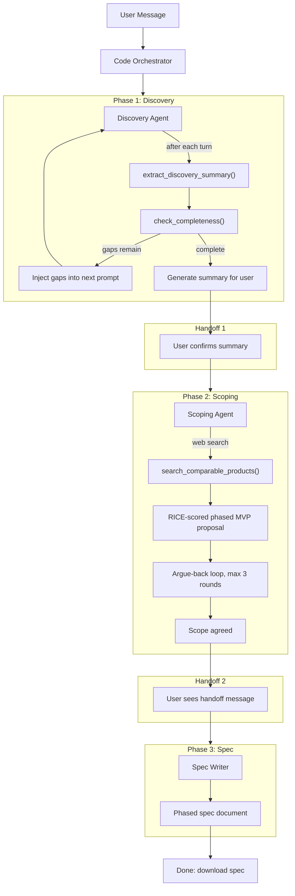

# System Design: AI PM Agent

High-level and low-level design of the AI PM Agent system. Kept in sync with the codebase.

---

## 1. Architecture Overview

Strictly sequential 3-phase pipeline: **Discovery → Scoping → Spec Writer**. A code-based orchestrator routes messages, enforces handoffs, and prevents skipping. No LLM orchestrator; transitions are deterministic and user-confirmed.

---

## 2. Agent Responsibilities and Boundaries

| Agent | Responsibility | Tools | Output |
|-------|----------------|-------|--------|
| **Discovery** | Conduct PM-style discovery interview. Cover target user, core problem, alternatives, why now, feature vision, success metrics, revenue model, constraints. Probe vague answers; one question at a time. | `extract_discovery_summary`, `check_completeness`, `classify_discovery_review` | Fills `DiscoverySummary`; when complete, shows summary for user confirmation. |
| **Scoping** | Take discovery output; search comparables; propose RICE-scored, phased MVP scope. Cut aggressively; justify cuts. Handle pushback (max 3 rounds). | `search_comparable_products`, `extract_scoping_output`, `classify_scoping_intent` | Fills `ScopingOutput` (mvp_features, cut_features, implementation_phases, RICE). |
| **Spec Writer** | Single-pass generation. Take discovery + scoping; produce phased Markdown spec. Non-conversational. | `SPEC_TEMPLATE`, `llm_call(spec)` | `spec_markdown` (phased product spec). |

**Orchestrator (code)**: Routes by `state.phase`. On discovery→scoping transition, shows handoff message and triggers scoping initial proposal. On scoping→spec transition, shows handoff and triggers spec generation. Skip prevention: if user tries to skip (e.g. "just write the spec"), respond with a gentle redirect.

---

## 3. State Management

**ConversationState** (`models/schemas.py`):

- `phase`: `"discovery"` | `"scoping"` | `"spec"` | `"done"`
- `messages`: list of `{role, content}` for full conversation
- `discovery_summary`: `DiscoverySummary` (extracted and merged after each discovery turn)
- `discovery_summary_shown`: whether we showed the discovery summary and are awaiting user confirmation
- `scoping_output`: `ScopingOutput` (filled after scoping proposal; includes RICE, implementation_phases)
- `negotiation_rounds`, `max_negotiation_rounds`, `scope_agreed`, `awaiting_scope_agreement`: scoping argue-back
- `spec_markdown`: final spec when phase is `"done"`

**Flow**: Discovery runs until `check_completeness()` passes (and min turns). Then show summary; user confirms → phase becomes scoping. Scoping runs until user agrees (or max rounds). Then phase becomes spec; spec writer runs once → phase becomes done.

---

## 4. LLM Routing

Task-based routing via `llm_call(task_type, messages)` in `models/llm.py`:

| task_type | Model | Use |
|-----------|--------|-----|
| `conversation` | GPT-OSS 20B (Groq) | Discovery and Scoping dialogue |
| `spec` | Llama 3.3 70B | Single-pass spec generation |
| `extraction` | Llama 3.1 8B | JSON extraction (discovery, scoping) |
| `classification` | Llama 3.1 8B | Intent: discovery review (CONFIRM/REVISE), scoping (AGREE/PUSHBACK/QUESTION) |

Config in `config.py`; retries and reasoning effort there.

---

## 5. Handoff Protocol

1. **Discovery → Scoping**: When discovery is complete, agent shows a summary and asks user to confirm. User says "yes" / "sounds good" → `classify_discovery_review` returns CONFIRM → orchestrator sets phase to scoping, displays handoff message, then calls scoping agent with empty message to generate initial proposal. User sees: handoff text + scoping proposal.
2. **Scoping → Spec**: When user agrees to scope, scoping agent sets phase to spec. Orchestrator displays handoff message, then calls spec writer (no user message). User sees: handoff text + full spec. Spec is also offered as download.

Handoff messages are defined in `orchestrator.py` (constants). No LLM-generated handoff text.

---

## 6. Data Schemas

**DiscoverySummary**: target_user, core_problem, current_alternatives, why_now, feature_wishlist, success_metric, revenue_model, constraints.

**Feature**: name, description, priority (P0/P1/P2), plus optional RICE (rice_reach, rice_impact, rice_confidence, rice_effort, rice_score) and phase (1/2/3).

**ImplementationPhase**: phase_number, name, goal, estimated_weeks, features (list of feature names).

**ScopingOutput**: mvp_features, cut_features, comparable_products, core_user_flow, scope_rationale, key_screens, implementation_phases.

**ConversationState**: see §3.

Completeness: `check_completeness(summary)` returns (score, gaps, is_complete). Discovery "complete" when score ≥ threshold, mandatory fields (target_user, core_problem) filled, and at least DISCOVERY_MIN_TURNS user messages.

---

## 7. Key Files

| Area | Files |
|------|--------|
| Entry | `app.py` (Chainlit), `orchestrator.py` |
| Agents | `agents/discovery.py`, `agents/scoping.py`, `agents/spec_writer.py` |
| State & LLM | `models/schemas.py`, `models/llm.py` |
| Config | `config.py` |
| Prompts | `prompts/discovery.py`, `prompts/scoping.py`, `prompts/spec_writer.py`, `prompts/extraction.py` |
| Tools | `tools/extraction.py`, `tools/completeness.py`, `tools/intent.py`, `tools/web_search.py`, `tools/templates.py` |

**Eval compatibility:** `eval/runner.py` builds `state_dict` from `state.discovery_summary.model_dump()` and `state.scoping_output.model_dump()` (when present). Both schemas include any new fields (e.g. `implementation_phases`, RICE on features); no eval code changes required.

This document is updated whenever the architecture or key contracts change.
